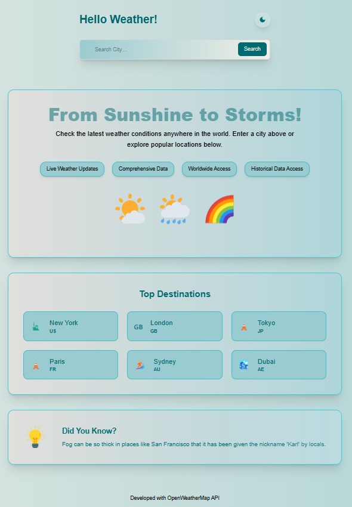
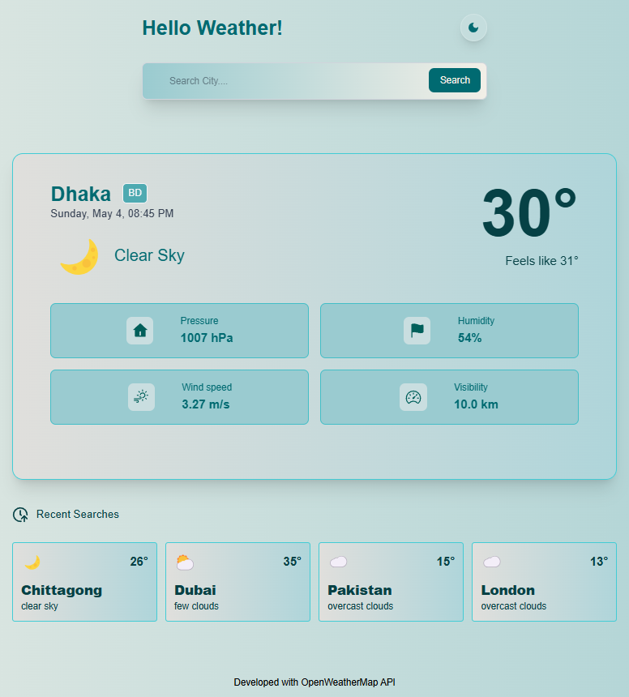
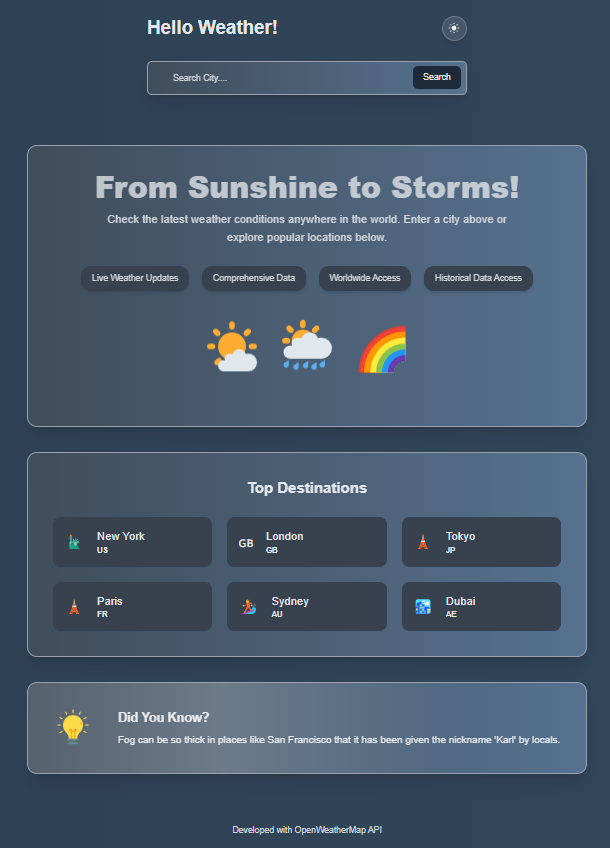
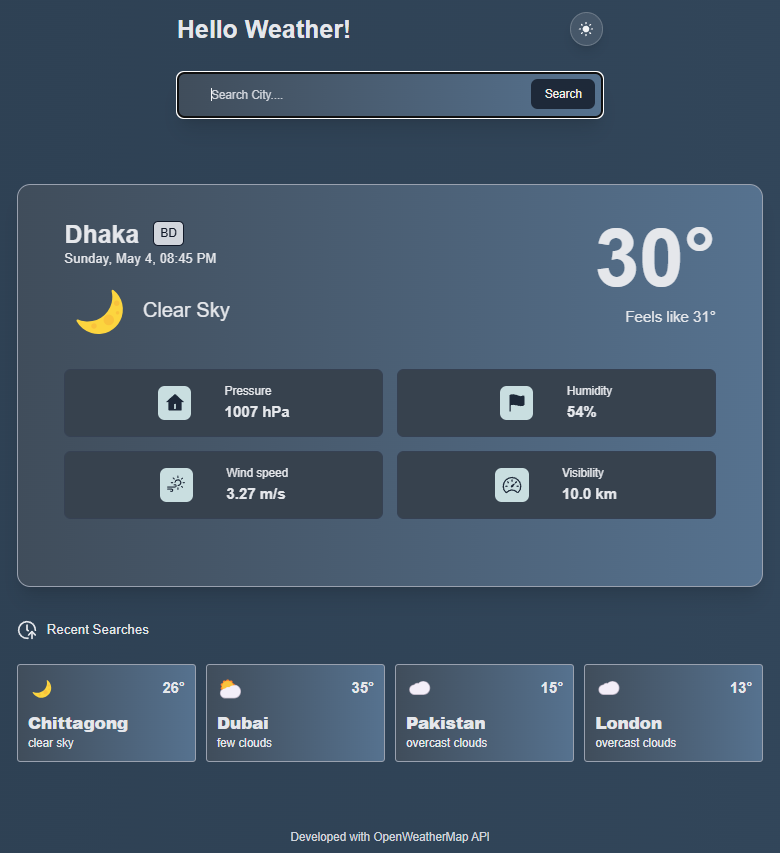

# Project Name:
## 🌤️ Weather App

# Screenshots
## 🌞 Light Mode

## 🌙 Dark Mode

# Live Link:
https://weather-app-d38c1.web.app/

# Purpose:
The purpose of this project is to develop a responsive weather application using react, redux and Tailwind CSS. This app allows users to search for any city and view real-time weather information fetched from the OpenWeatherMap API. This project highlights practical skills in API integration, state management, and responsive UI design..

# Features:

 🔍 Search weather by city
 🌡️ Display temperature, humidity, wind speed, visibility, and condition icon
 🌙 Supports dark mode
 📱 Fully responsive design for all screen sizes
 ⚡ Live data fetching from OpenWeatherMap API
 🧠 Error handling and loading states
 🎨 Custom fonts and reusable component styling 

# ⚙️ Tech Stack: 

## 🧩 Core Libraries & Frameworks
 ⚛️ React (v19) – Frontend library for building UI components
 🧱 React DOM – DOM rendering for React applications
 ⚡ Vite – Lightning-fast development server and build tool

## 🌐 Routing & State Management
 🧭 React Router – Handles client-side routing
 🧠 Redux – Manages global application state

## 🎨 Styling
 🎨 Tailwind CSS (v4) – Utility-first CSS framework for styling

## APIs & External Services
🔗 Axios – HTTP client for calling the OpenWeatherMap API
🔥 Firebase – Used for hosting
🎞️ Lottie React – Add Lottie animations for loading

